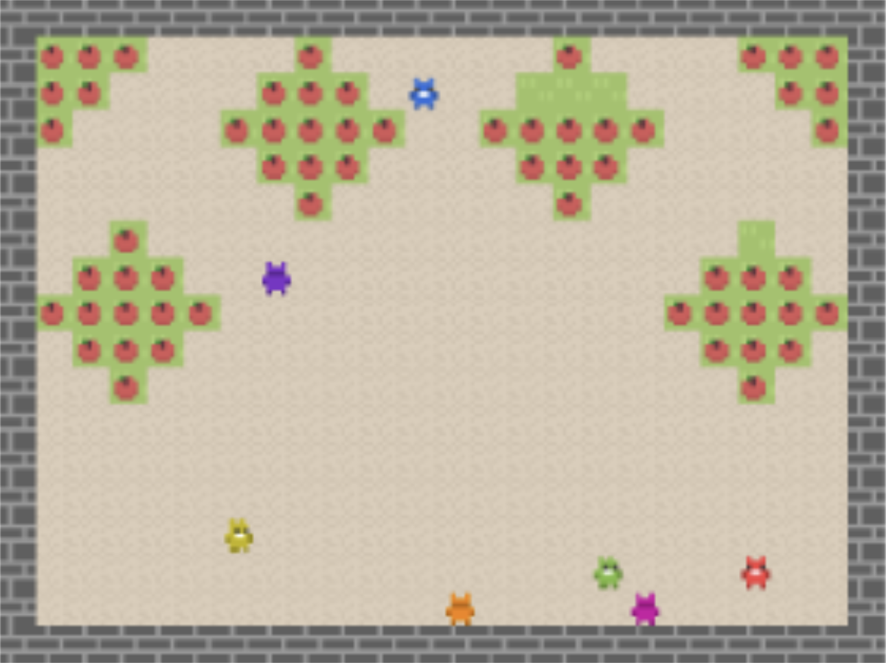
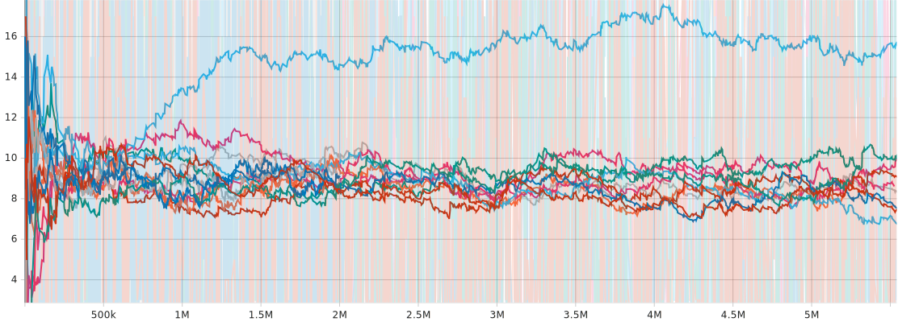
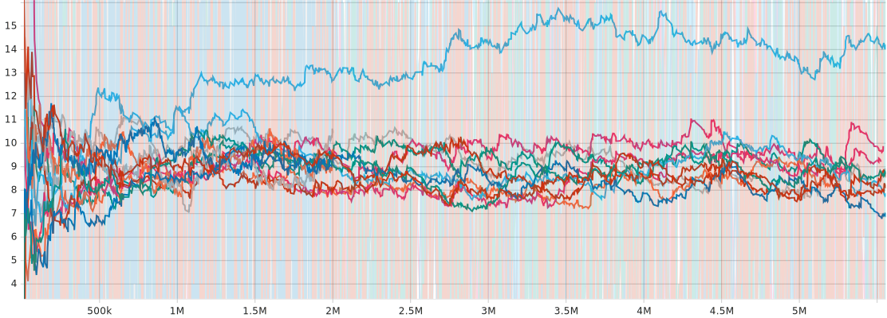
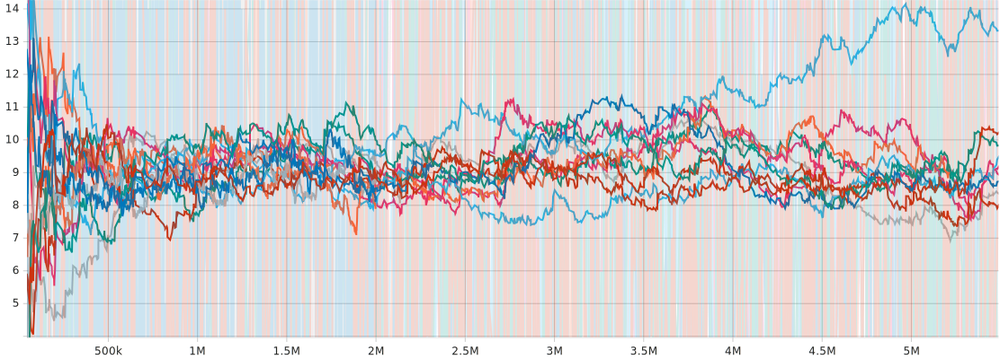

# Understanding Empathy and Cooperation in Multi-Agent Reinforcement Learning

## Introduction
In navigating complex social dilemmas, human groups often seek avenues for cooperation. However, traditional models rooted in behavioral economics face limitations, as they can only elucidate cooperative behavior within simplified, static scenarios such as matrix games, neglecting temporal dynamics. Recent advancements in multi-agent reinforcement learning offer a more comprehensive approach. Research indicates that while not universally exhibited, many human individuals display a preference against inequity, shaping their behavior in social dilemmas. This inclination tends to promote pro-social tendencies and feel negative sentiments if they are the sole defectors, influencing the resolution of matrix game social dilemmas. Nevertheless, assuming access to rewards is a strong assumption to make, as in real-world scenarios humans cannot accurately perceive others’ feelings. In our project, we aim to enforce cooperation among agents without granting access to rewards. From our four proposed formulations, Simple Inequity Aversion (SIA) shows promising results that agents may potentially learn without access to rewards.

## Research Questions
In this work, we expect to understand more about how the expectation of future rewards that other agents receive can change empathetic social interactions. More empathetic agents will probably expect all the others to be as well, and the same goes for more egotistical ones. We therefore ask:

- How does this impact the equilibrium?
- Do empathetic agents become even more unselfish since they expect everyone to behave similarly?

Moreover, how does this translate to human interactions? If someone is interacting with someone that they do not know, they will likely model the other agents similarly to how they behave themselves and we expect to gather insights from such social interactions.

We argue that individuals typically rely solely on their own perception of rewards, value function, to generate empathetic behavior for two main reasons: firstly, because one cannot directly experience others' rewards, and secondly, because it is natural to assume that others will behave in a manner similar to oneself, since the value function incorporates the policy for future rewards.

## Environment
In our project, agents will interact and learn in the **Common Harvest Open** environment from Agapiou et al. (2022). In the game, apples are scattered across the environment and can be eaten for a reward of 1. The rate at which consumed apples grow back depends on how many other apples are nearby within a 2-unit radius. If there are three or more apples nearby, the probability of regrowth is 0.025. If there are exactly two apples, it's 0.005. With just one apple nearby, the probability drops to 0.001, and if there are no nearby apples, regrowth probability is 0. This means if all apples in a group are eaten and there are no others nearby, the group cannot recover. So, agents must be cautious when eating apples from a group. In a single-agent situation, there's usually no reason to eat the last apple in a group, except maybe at the end of a task. However, in a multi-agent scenario, each agent has an incentive to eat the last apple before another agent does. This leads to a common problem known as the tragedy of the commons, which is why the environment is named as such. 

*Figure: The Common Harvest Open environment implementation.*

## Results
We graphed the sum of the rewards for each episode as a measure of "learning". 

*Figure: Sum of the undiscounted rewards per episode for 3 of the 7 agents.*

Figure above shows the graphs for 3 of the 7 agents where each curve corresponds to a variation of the algorithms tested. We can see that most of the curves stabilize at around 10 rewards per episode, which is consistent with what we would expect if a tragedy of the commons occurred. They also seem to follow our baseline (the green curve).

However, there is a single blue curve that seems to achieve a much higher reward per episode consistently for all agents. This corresponds to one of our SIA agents, which seemed to learn to cooperate to some degree. While this result is not conclusive, this indicates a good path of investigation moving forward. We hope to do a more thorough parameter sweep of the SIA variation using several seeds in the future.

## Reproducing the Results
You can easily install everything by executing `requirements.txt`. Then, you can try with different algorithms we are proposing (details of the algorithms are in our report) and you should have the same results. We left some model checkpoints in the `models` folder.

## Citation
Agapiou, J., et al. (2022). *Melting Pot 2.0: Measuring and Understanding Multi-Agent Learning Complexity*. Proceedings of the 39th International Conference on Machine Learning.

## License
This project is licensed under the MIT License - see the LICENSE.md file for details.

## Acknowledgments
We would like to thank our collaborators and the research community for their invaluable insights and contributions.
