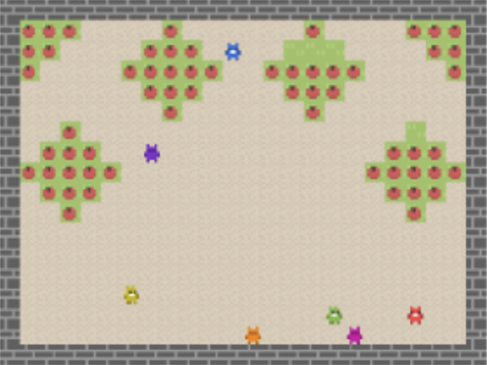
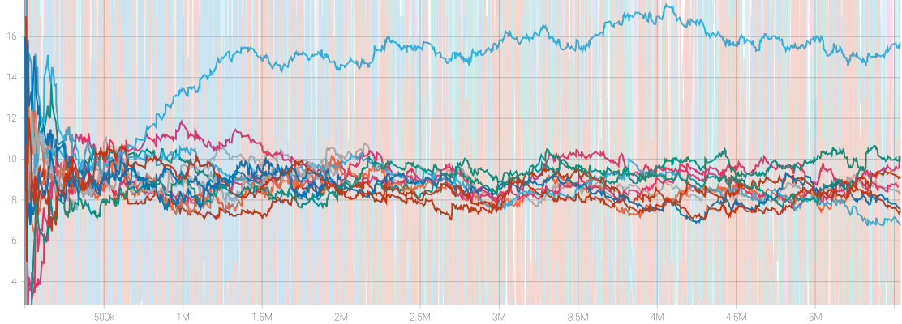
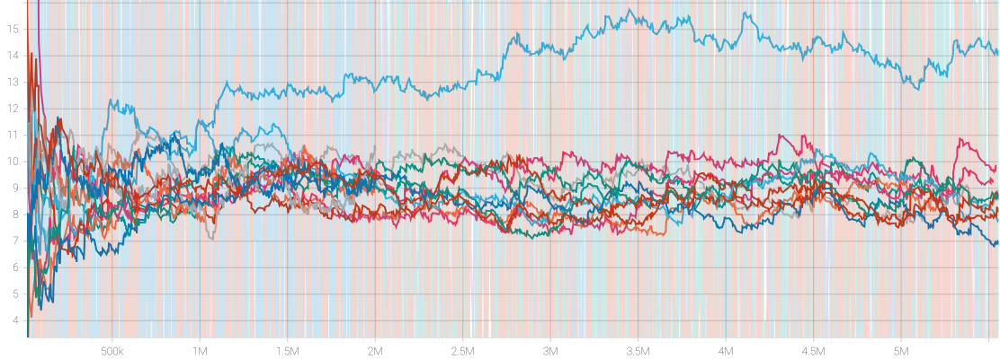
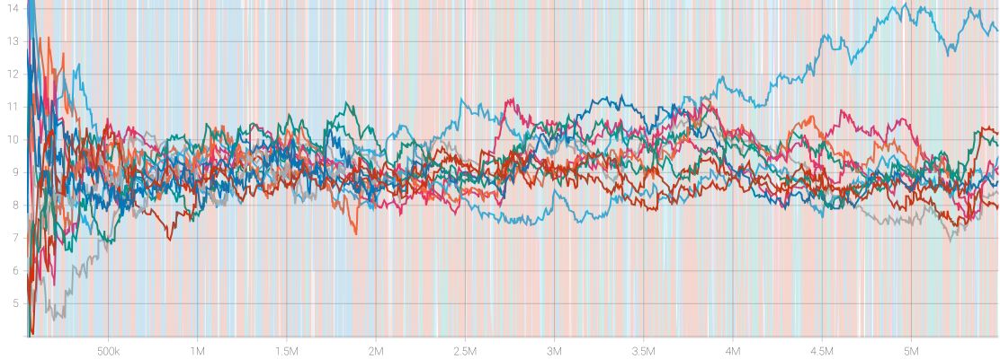

# Understanding Empathy and Cooperation in Multi-Agent Reinforcement Learning

## Introduction
In navigating complex social dilemmas, human groups often seek avenues for cooperation. However, traditional models rooted in behavioral economics face limitations, as they can only elucidate cooperative behavior within simplified, static scenarios such as matrix games, neglecting temporal dynamics. Recent advancements in multi-agent reinforcement learning offer a more comprehensive approach. Research indicates that while not universally exhibited, many human individuals display a preference against inequity, shaping their behavior in social dilemmas. This inclination tends to promote pro-social tendencies and feel negative sentiments if they are the sole defectors, influencing the resolution of matrix game social dilemmas. Nevertheless, assuming access to rewards is a strong assumption to make, as in real-world scenarios humans cannot accurately perceive others’ feelings. In our project, we aim to enforce cooperation among agents without granting access to rewards. From our four proposed formulations, Simple Inequity Aversion (SIA) shows promising results that agents may potentially learn without access to rewards.


## Research Questions
In this work, we expect to understand more about how the expectation of future rewards that other agents receive can change empathetic social interactions. More empathetic agents will probably expect all the others to be as well, and the same goes for more egotistical ones. We therefore ask:

- How does this impact the equilibrium?
- Do empathetic agents become even more unselfish since they expect everyone to behave similarly?

Moreover, how does this translate to human interactions? If someone is interacting with someone that they do not know, they will likely model the other agents similarly to how they behave themselves and we expect to gather insights from such social interactions.

We argue that individuals typically rely solely on their own perception of rewards, value function, to generate empathetic behavior for two main reasons: firstly, because one cannot directly experience others' rewards, and secondly, because it is natural to assume that others will behave in a manner similar to oneself, since the value function incorporates the policy for future rewards.

## Environment
In our project, agents will interact and learn in the **Common Harvest Open** environment from Agapiou et al. (2022). In the game, apples are scattered across the environment and can be eaten for a reward of 1. The rate at which consumed apples grow back depends on how many other apples are nearby within a 2-unit radius. If there are three or more apples nearby, the probability of regrowth is 0.025. If there are exactly two apples, it's 0.005. With just one apple nearby, the probability drops to 0.001, and if there are no nearby apples, regrowth probability is 0. This means if all apples in a group are eaten and there are no others nearby, the group cannot recover. So, agents must be cautious when eating apples from a group. In a single-agent situation, there's usually no reason to eat the last apple in a group, except maybe at the end of a task. However, in a multi-agent scenario, each agent has an incentive to eat the last apple before another agent does. This leads to a common problem known as the tragedy of the commons, which is why the environment is named as such. 


*Figure: The Common Harvest Open environment implementation.*

## Results
We graphed the sum of the rewards for each episode as a measure of "learning". 




*Figure: Sum of the undiscounted rewards per episode for 3 of the 7 agents.*

Figure above shows the graphs for 3 of the 7 agents where each curve corresponds to a variation of the algorithms tested. We can see that most of the curves stabilize at around 10 rewards per episode, which is consistent with what we would expect if a tragedy of the commons occurred. They also seem to follow our baseline (the green curve).

However, there is a single blue curve that seems to achieve a much higher reward per episode consistently for all agents. This corresponds to one of our SIA agents, which seemed to learn to cooperate to some degree. While this result is not conclusive, this indicates a good path of investigation moving forward. We hope to do a more thorough parameter sweep of the SIA variation using several seeds in the future.

> **Note on the preliminary results above.** They were produced with the scripts now in
> `legacy/`, which contained a tensor-alignment bug that made PPO's ratio, value targets and
> the social term compare unrelated (agent, timestep) pairs (see `legacy/README.md`).
> They should be regenerated with `train.py` before being used in the paper.

## Code

```
train.py                 single entrypoint: independent PPO learners (CleanRL style) + social term
evaluate.py              roll out a checkpoint, report metrics, optional video
empathy_marl/
  envs.py                env factory: `pd`, `meltingpot:<substrate>`, `debug:image`
  prisoners_dilemma.py   N-player repeated Prisoner's Dilemma (PettingZoo ParallelEnv)
  agents.py              CNN / MLP trunk, optional LSTM (ppo_atari_lstm.py), one network per agent
  empathy.py             social term F_i (ei, svo, sia, ia) for the value signal (X_i) and the reward signal (intrinsic reward)
  metrics.py             efficiency / equality / sustainability per episode
scripts/sweep_pd.sh, sweep_meltingpot.sh, summarize_runs.py   (local sweeps + results table)
scripts/make_grid.py, scripts/slurm/                          (parameter grids + Compute Canada job arrays)
tests/                   pytest suite (alignment, formulas, envs, end-to-end smoke tests)
legacy/                  original scripts, kept for reference only
```

### Install

```bash
python -m venv .venv && source .venv/bin/activate
pip install -r requirements.txt          # Melting Pot (dm-meltingpot / dmlab2d) is Linux only
python -m pytest tests -q                # 44 tests, ~30 s, no Melting Pot needed
```

### Train

```bash
# 1. sanity check: repeated Prisoner's Dilemma, per-agent social preference (selfish vs. empathetic)
python train.py --env-id pd --max-cycles 100 --formulation ei --signal value --alpha 0,20 --seed 1 \
    --num-envs 8 --num-steps 128 --total-timesteps 1000000

# 2. Commons Harvest, feed-forward CNN, one formulation / seed
python train.py --env-id meltingpot:commons_harvest__open --formulation ei --alpha 0.01 --seed 1

# 3. partial observability: recurrent policy (needs num_envs % num_minibatches == 0)
python train.py --env-id meltingpot:commons_harvest__open --formulation sia --alpha 0.1 \
    --recurrent --num-envs 4 --num-minibatches 4

# 4. the same functional form driven by the other agents' REWARDS (baseline with reward access);
#    ia + reward is the Hughes et al. (2018) inequity-aversion baseline
python train.py --env-id meltingpot:clean_up --formulation ia --signal reward --alpha 5 --beta 0.05

# 5. N-player Prisoner's Dilemma (payoffs averaged over all pairings)
python train.py --env-id pd --num-agents 4 --formulation ei --signal value --alpha 20

# sweeps over formulations x signal x alpha x seeds
SEEDS="1 2 3 4 5" scripts/sweep_pd.sh                          # 2 players, value and reward signals
NUM_AGENTS=4 MIXED="0,20,20,20" scripts/sweep_pd.sh            # 4 players, one selfish agent
SUBSTRATE=clean_up EXTRA="--recurrent --num-envs 4" scripts/sweep_meltingpot.sh
python scripts/summarize_runs.py runs/pd_n2                    # mean +/- std over seeds per configuration
```

Two orthogonal switches define a method:

* `--formulation`: the functional form `F_i` of the social term: `none` (plain PPO), `ei`,
  `svo`, `sia`, `ia`.
* `--signal`: what `F_i` is computed from.  `value` (our proposal) uses the agent's **own
  critic** on the other agents' next observations, `z[i, j] = V_i(s_j')`, and adds
  `X_i = F_i(z)` to the PPO advantage; no agent ever sees another agent's reward.  `reward`
  (the literature's approach) uses the others' temporally smoothed rewards, `z[i, j] = e_j`,
  and adds `F_i(z)` as an intrinsic reward (`--reward-lambda 0.975` as in Hughes et al.; `0`
  for raw rewards as in Schwarting et al.).  Because both share the same `F_i`, a
  value-vs-reward comparison isolates the signal.

`--alpha/--beta/--phi` accept one value or a comma-separated per-agent list (`--alpha 0,20` =
selfish vs. empathetic).  `--num-agents` sets the player count for `pd` / `debug:image`
(Melting Pot substrates fix their own).  Every run writes TensorBoard logs, `args.json` and
`agents.pt` to `runs/<env>__<formulation>_<signal>__<ff|lstm>__<params>__s<seed>__<time>/`.
Useful TensorBoard tags: `charts/collective_return`, `charts/episodic_return/<agent>`,
`charts/equality`, `charts/sustainability`, `charts/cooperation_rate/<agent>` (PD only),
`social/term_abs_mean/<agent>` vs `social/advantage_abs_mean/<agent>` (value signal) or
`social/env_reward_abs_mean/<agent>` (reward signal) to judge the scale of alpha.

Scale of alpha: with `--signal value` the term competes with the advantage (magnitude ~10-25
in PD after a few updates), so alphas of order 5-100 are needed; with `--signal reward` it
competes with the reward (order 1).  Note also that `sia`/`ia` on the value signal are
identically zero whenever two agents are in the *same* observed situation (e.g. both defect
in a symmetric 2-player PD), so they cannot move a population away from an equitable
all-defect equilibrium; `ei`/`svo` can.

### Hyper-parameter grids on Compute Canada (SLURM)

`scripts/make_grid.py` writes one `train.py` argument line per job; by default it reproduces
the report's parameter table (EI/SIA/SVO/IA, alpha in {0, 0.003, 0.01, 0.03, 0.1, 0.3},
phi in {pi/2, pi/3, pi/4, pi/6}, beta in {alpha/2, alpha/3, alpha/10}; alpha = 0 becomes one
plain-PPO baseline per seed), crossed with `--signals` and `--seeds`.  `scripts/slurm/`
runs a grid file as a job array (task N = line N):

```bash
# once, on a login node (compute nodes have no internet): build the virtualenv
VENV=~/envs/empathy scripts/slurm/setup_env.sh              # add WITH_MELTINGPOT=1 for Melting Pot

# the report's table on the 2-player PD, value + reward signal, 5 seeds  -> 455 jobs
python scripts/make_grid.py --env-id pd --seeds 1 2 3 4 5 -o grids/pd_report.txt
# wider alpha range for the value signal (it competes with the advantage scale)
python scripts/make_grid.py --env-id pd --signals value --alphas 0 0.1 1 3 10 30 100 --seeds 1 2 3 4 5 -o grids/pd_wide.txt
# selfish player_0 vs. empathetic player_1
python scripts/make_grid.py --env-id pd --mixed "0,{a}" --alphas 0 1 10 30 --seeds 1 2 3 4 5 -o grids/pd_mixed.txt

export SLURM_ACCOUNT=def-XXXX
scripts/slurm/submit.sh grids/pd_report.txt 50                 # <= 50 concurrent CPU jobs, ~5 min each
scripts/slurm/submit.sh grids/harvest.txt 8 --gres=gpu:1 --cpus-per-task=4 --mem=16G --time=12:00:00

python scripts/summarize_runs.py $SCRATCH/empathy_runs/pd_report --csv pd_report.csv
python scripts/make_grid.py --seeds 1 2 3 4 5 --latex          # the table for the paper
```

Runs land in `$SCRATCH/empathy_runs/<grid name>/` (override with `RUN_DIR`), SLURM logs in
`slurm_logs/`.  `run_grid.sh` can be dry-run locally:
`SLURM_ARRAY_TASK_ID=3 VENV=.venv scripts/slurm/run_grid.sh grids/pd_report.txt`.

### Evaluate

```bash
python evaluate.py --checkpoint runs/<run>/agents.pt --episodes 10 --out metrics.json
python evaluate.py --checkpoint runs/<run>/agents.pt --episodes 1 --video harvest.mp4
```

### How the social term enters PPO

With `v_next[t, i, j] = V_i(s_j^{t+1})` (agent *i*'s own critic on agent *j*'s next observation,
computed once per rollout under `no_grad`), the minibatch coefficient is
`A_GAE + X_i`, which is then normalised per agent and used in the clipped surrogate exactly as
in CleanRL.  `X_i` is a constant with respect to the parameters (like the advantage); it is
masked to zero at episode ends.  For recurrent critics agent *i* keeps a separate hidden state
per observed agent *j* ("what if I had seen what *j* saw").

### Observations and the value-based mechanism

For `V_i(s_j)` to say anything about *j*'s situation, `s_j` has to be **agent specific**.  The
Melting Pot egocentric `RGB` view is.  A "fully observable" variant that gives every agent the
same global `WORLD.RGB` frame would make `V_i(s_j) = V_i(s_i)` and switch the social term off;
a full-information setting therefore needs an agent-centred observation (e.g. global frame plus
the agent's own egocentric view, or the agent's position marked in an extra channel).  See
`empathy_marl/envs.py` (`MELTINGPOT_OBS_KEY`) for the extension point.


## Citation
Agapiou, J., et al. (2022). *Melting Pot 2.0: Measuring and Understanding Multi-Agent Learning Complexity*. Proceedings of the 39th International Conference on Machine Learning.

## License
This project is licensed under the MIT License - see the LICENSE.md file for details.
